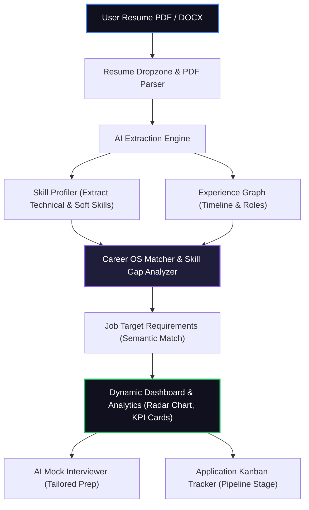

# SmartToolStack AI Career OS - AI-Powered Career Optimization & Tracker 🚀💼

SmartToolStack AI Career OS is an intelligent, AI-powered Career Intelligence Platform and career management suite. It helps users analyze resumes, improve ATS performance, identify skill gaps, discover suitable career paths, generate personalized learning roadmaps, simulate mock interviews, and track job applications in an intuitive, glassmorphic dark-mode dashboard.

---

## 🛠️ Tech Stack

- **Frontend**: Next.js (App Router) + React + TypeScript + Tailwind CSS + Framer Motion (glassmorphic dark-mode UI with smooth micro-animations)
- **Backend**: FastAPI (Python) for fast asynchronous processing and ATS scoring calculations
- **AI Engine**: Google Gemini API / OpenAI GPT-4o for intelligent resume parsing, career roadmapping, and interview question generation
- **NLP & Parsing**: PyMuPDF / `pdf-parse` / Tesseract OCR for extracting content from resumes, CVs, and cover letters
- **Analytics & Visualizations**: Recharts / Chart.js for rendering dynamic skill gap analyses and application pipelines

---

## ✨ Key Features

1. **Resume Upload & Parsing**: Easily drag and drop CVs or resumes (PDF, TXT, DOCX) to automatically extract professional skills, work experience, and educational background.
2. **ATS Score Analysis**: Analyzes your resume formatting and content structure to determine compatibility with ATS systems.
3. **Skill Gap Analysis & Match Scoring**: Compares your parsed resume against targeted job descriptions using semantic similarity, identifying missing skills and generating an interactive radar chart showing critical areas of improvement.
4. **Career Path Recommendation & Learning Roadmaps**: Discovers suitable career paths based on your experience and generates personalized learning roadmaps to bridge gaps.
5. **Dynamic Application Tracker**: A Kanban-style pipeline (Wishlist, Applied, Interviewing, Offer, Rejected) to organize and manage job applications.
6. **AI Mock Interview Simulator**: Tailored, role-specific technical and behavioral questions generated in real-time with instant performance feedback.
7. **Interactive Dashboard**: High-fidelity central hub featuring application statistics, weekly activity charts, profile strength ratings, and prioritized tasks.

---

## 📐 System Architecture



---

## 🚀 Installation & Setup

### Prerequisites

- **Node.js**: 18.x or higher
- **Python**: 3.9 or higher (for backend services)
- **NPM** or **Yarn**

### 1. Clone the Repository

```bash
git clone https://github.com/Harsha-Movva/smarttoolstack-ai-career-os.git
cd smarttoolstack-ai-career-os
```

### 2. Install Dependencies

#### Frontend (Next.js)
```bash
npm install
```

#### Backend (FastAPI)
```bash
cd backend
pip install -r requirements.txt
cd ..
```

### 3. Environment Variables Configuration

Create a `.env.local` file in the root directory and add your API keys:

```env
NEXT_PUBLIC_GEMINI_API_KEY=your_gemini_api_key_here
# OR
OPENAI_API_KEY=your_openai_api_key_here
```

### 4. Run the Development Server

#### Frontend
```bash
npm run dev
```

#### Backend
```bash
cd backend
uvicorn main:app --reload
```

---

## 📊 Career Matching & Skill Gap Analysis

1. **Skill Vector Similarity ($S_v$)**: Measures the semantic overlap between the user's skill vector ($\vec{U}$) and the target job description's skill vector ($\vec{J}$):
   $$\text{Match Score} = \cos(\vec{U}, \vec{J}) = \frac{\vec{U} \cdot \vec{J}}{\|\vec{U}\| \|\vec{J}\|}$$

2. **Weighted Gap Index ($G_w$)**: Focuses on core missing keywords, weighted by industry demand and frequency ($w_i$):
   $$\text{Gap Index} = \sum_{i \in \text{Missing}} w_i \times \text{Similarity}(S_i, J_i)$$

### AI Extraction Prompt Structure

The system formats the resume data and targets specific schemas using the following JSON-structured prompt style:

```javascript
const extractionSchema = {
  name: "string",
  email: "string",
  skills: ["string"],
  experience: [{ role: "string", company: "string", duration: "string", description: "string" }],
  education: [{ degree: "string", institution: "string", graduationYear: "string" }]
};

async function parseResumeWithAI(extractedText) {
  const prompt = `Extract all details from this resume text according to the following JSON structure: ${JSON.stringify(extractionSchema)}. Text: ${extractedText}`;
  // Send prompt to Gemini/OpenAI API...
}
```

---

## 📂 Project Structure

```
smarttoolstack-ai-career-os/
├── app/
│   ├── layout.tsx         # Root layout with theme context and navigation
│   └── page.tsx           # Home entry page showcasing the main cockpit
├── components/
│   ├── cards              # Application tracker and job cards
│   ├── charts             # Skill gap radar and funnel analytics charts
│   ├── dashboard          # Main cockpit layout & overview grids
│   ├── layout             # Sidebar, Navbar, and Footer layouts
│   └── upload             # Resume drag-and-drop zone
├── lib/                   # AI utility configurations and helper functions
├── types/                 # Shared TypeScript interfaces (User, Job, Application)
├── package.json           # Node scripts and project dependencies
└── README.md              # Project documentation
```

---

*Developed by MUNNA & Harsha-Movva © 2026*
